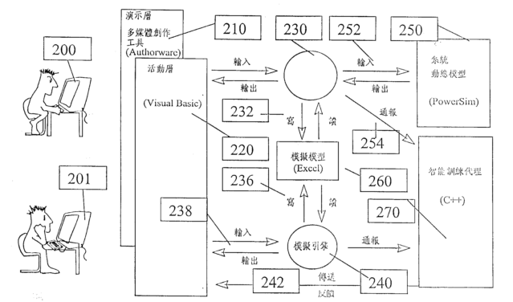
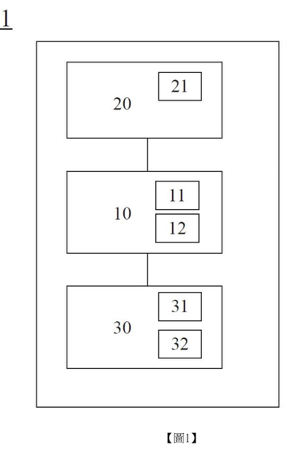

# [全球專利檢索系統](https://gpss4.tipo.gov.tw/gpsskmc/gpssbkm?.e87900656940100000007C00000E00000000010002D0000C0006008504421)

# [反向學習歷程與鼓勵教學之系統 APPARATUS FOR REVERSE PORTFOLIO LEARNING WITH ENCOURAGEMENT SYSTEM](https://gpss4.tipo.gov.tw/gpsskmc/gpssbkm?!!FRURLTWI260563B)

### 專利資訊文章整理

---

#### 專利名稱

反向學習歷程與鼓勵教學之系統  
APPARATUS FOR REVERSE PORTFOLIO LEARNING WITH ENCOURAGEMENT SYSTEM

#### 摘要

本發明揭露一種反向學習歷程與鼓勵教學之系統，利用考卷評量、學習盲點診斷、個性化遊戲、個性化課程四步曲的方法，顯示學生的學習能力（Effort）、學習演進（Progress）與學習成果（Achievement），提供學習者完整的學習歷程（Portfolio）與自我反省，整個學習歷程以連續考卷評量為開始，診斷學習者的學習盲點，再依個別化的需求，設計遊戲與課程，使學習更有效率。另有一完整性的鼓勵系統，提供學習者一個進階式的學習鼓勵，導引學習者正確學習方向，利用系統化的升等與進階鼓勵學習者，引導正確學習方向，提高學習效率。

#### 書目資料

- **申請日**: 2004年12月7日
- **公告日**: 2006年8月21日
- **申請號**: TW093137912
- **公告號**: TWI260563B
- **證書號**: I260563
- **申請人**: 草莓資訊股份有限公司  
  臺北市南港區三重路19之3號7樓之一南港軟體工業園區D棟  
  STRAWBERRY SOFTWARE INC. (TW)
- **發明人**: 沈青蓉; SHEN, SANDY (TW); 洪永城; HUNG, YUNG CHEN (TW)
- **被參考次數**: 00007
- **公報IPC**: (IPC 1-7) : G09B 7/00
- **IPC**: G09B 7/00(2006.01)
- **公報卷期**: 33-24
- **類別碼**: B

---

#### 詳細說明

**技術領域**  
本發明涉及一種反向學習歷程與鼓勵教學之系統，系統包括考卷評量模組、學習盲點診斷模組、個性化遊戲模組、個性化課程學習模組、鼓勵模組等子系統，利用不斷的評量了解學生學習盲點，依據每個人的學習盲點設計個別化的學習課程，利用反向學習歷程，能有效發現個別性學習盲點，因此提升學習效率，利用連續性的評量發現學習盲點，是此反向學習歷程的特色。鼓勵模組的設計，提供一個完整性、進階段性的鼓勵制度，與升等方式，利用鼓勵導引教學方向，使學習更有方向、更有效率。

**先前技術**  
傳統學習策略利用課程、遊戲、評量三部曲來顯示學生的學習努力、學習演進與學習成果，提供學習者完整的學習歷程與自我反省，但無法預先了解學習者個別化的差異並設計個性化的課程。例如，2001年10月21日公開的專利「線上學習成果評鑑系統及其方法」揭露一種網路上設置題庫、試卷資料庫與測驗成績資料庫，測驗完畢後有評鑑分析。2004年6月11日公開的專利「可執行於一電腦之學習能力鑑別系統」揭露一種鑑別被鑑定者的學習能力，並產生適合該鑑定者的最佳學習模式。2004年10月1日公開的專利「瞬間成就學習系統及方法」揭露藉由將學習者學習之成果立即顯示於電腦螢幕上，學習者可立即瞭解本身學習之成果。然而，這些線上評量為主的學習方法限縮於學習歷程中的評量階段，無法提供完整學習歷程各步驟的整體性方案，也無法與課程有效串連。

**發明內容**  
本發明採用反向電子學習歷程的概念，利用數位科技與多媒體呈現與組織學習歷程。反向學習歷程包含考卷評量、學習盲點診斷、個性化遊戲、個性化課程四部曲。學習歷程可做為學習評鑑與紀錄，應用於不同教學與學習情境中。本系統以評量為始，依需求設計個性化遊戲與課程，期盼創造專屬於學生的全方位數位學習環境。

本系統包括：
1. **考卷評量模組**：連續性的測驗了解個人學習盲點，並依據這些結果設計個性化的遊戲與課程內容。
2. **學習盲點診斷模組**：依據學習者持續性的測驗與結構化分類，診斷學習盲點。
3. **個性化遊戲模組**：利用盲點診斷結果，自動導引學習者針對脆弱單元重點學習。
4. **個性化課程模組**：依據學習盲點診斷結果，自動設計個性化課程。
5. **鼓勵模組**：設計完整性、階段性的升等制度，提供有方向性的獎勵系統，激發學習者潛能。


# [具有動態反饋資訊的基於目標之教育系統的製造系統、方法和物品 A system, method and article of manufacture for a goal based educational system with dynamic feedback information](https://gpss4.tipo.gov.tw/gpsskmc/gpssbkm?!!FRURLTW523676B)

### 發明摘要

本發明揭示了一種提供基於目標的學習系統，該系統利用基於規則的專家訓練系統來提供認知性的教育經歷。此系統為用戶提供模擬的環境，該環境提供了以最佳方式理解和解決問題的商業機會。此外，系統能夠記錄錯誤並動態地提供矯正性的教育資料，以幫助用戶建立在商業工作中獲得成功所需的技能。此系統利用人工智慧引擎來驅動個性化的動態反饋，反饋中還具有用於模擬真實世界環境和互動的同步視頻和圖形。學習系統中整合了多個“正確”答案，以容許個性化的學習經歷，學員可以自行控制學習步調。健全的商業模型支持現實活動，讓用戶體驗其行動和決策在真實世界中的影響，並使實時決策和教育資料的綜合成為必要。

### 書目資料
- **申請日**: 1999-12-22
- **公告日**: 2003-03-11
- **申請號**: TW088122824
- **公告號**: TW523676B
- **證書號**: 175532
- **申請人**: 英得利克公司 (美國); INDELIQ, INC. (US)
- **發明人**: 埃瑞克·傑弗裡·蘭勒特 (美國); LANNERT, ERICE JEFFREY (US); 約瑟夫·邁克爾·茨安察格裡尼 (美國); BURGESS, OLIVIA RUTH (GB); 奧利威爾·拉斯·伯格斯 (英國); CIANCAGLINI, JOSEPH MICHAEL (US)
- **代理人**: 黃志揚
- **優先權**: US 19980221138 1998-12-22
- **被參考次數**: 00001
- **公報IPC**: G06F 15/18 (2006.01)
- **公報卷期**: 30-08
- **類別碼**: B

### 發明背景

當建立基於知識的系統或專家系統時，需要知識工程師和領域專家的合作。知識工程師使用專家的知識來創建應用程式，但此過程勞動密集、速度慢且容易出錯。既有技術系統中經常無法達成知識工程師對專家系統的反饋，傳統的系統通過耗時的反饋循環將知識獲取與知識驗證結合起來。目前的教育系統缺乏推動力，使用靜態、僵硬編碼的反饋來增加視覺吸引力和闡釋觀念，這些系統通常僅支持“正確”的答案，且僅支持由一個定義好的路徑來完成訓練，未能提供創造性的學習環境。

### 發明概述

本發明提供了一種基於目標的學習系統，利用基於規則的專家訓練系統提供認知性的教育經歷。該系統提供模擬的環境，幫助用戶理解和解決問題。此外，記錄錯誤並動態提供矯正性教育資料，利用人工智慧引擎驅動個性化的動態反饋，包括同步視頻和圖形的模擬真實世界環境和互動。學習系統整合了多個“正確”答案，允許個性化學習經歷，學員可自行控制學習步調。健全的商業模型支持現實活動，允許用戶體驗模擬環境中的行動在真實世界中的影響，容許實時決策和教育資料的綜合。

### 詳細說明

依據本發明的系統的較佳實施例，較好在個人計算機上實施，例如IBM相容個人計算機、Apple的Macintosh計算機或Unix工作站。硬件環境包括中央處理器、多個透過系統總線互聯的部件，如隨機存取記憶體、唯讀記憶體、I/O適配器、用戶界面適配器、通信適配器和顯示適配器。較佳實施例使用JAVA、C和C++語言寫成，並利用物件導向程式設計方法。依據較佳實施例的模擬引擎基於Microsoft Visual Basic的元件，能模擬實際商業功能並作為學員完成的任務。模擬引擎接受模擬輸入並計算不同的輸出，然後在預定的時間將模擬的狀態通知系統，以獲得即時反饋。

#### 元件之間的關係

模擬模型執行學生學習的商業功能，是應用的核心。動作層允許用戶通過讓輸入進入模擬引擎並接收模擬模型的輸出來指導模擬。模擬模型的輸出傳遞到智能教練代理（ICA），ICA分析模擬模型的輸入和輸出，並基於一套規則產生反饋，該反饋通過Visual Basic體系結構顯示出來。

#### 系統體系結構

依據一較佳實施例，系統體系結構包括演示層和活動層，通過控制顯示特定內容主題的訊息使通信更加方便。健全的商業模型提供了對現實活動的支持，允許用戶體驗模擬環境中的行動在真實世界中的影響，並容許其作出需要教育資料的實時決策和綜合之決策。系統整合了多個“預設計”學習互動，例如訊息的拖放動作、情境評估／活動計劃、訪談、發表、性能測量、決策影響的“時間跳轉”等。

#### 反饋系統

反饋對每個完成課程的個人都是獨特的，支持“設計到”課程中的客戶文化訊息。商業模擬方法包括對內容獲取、故事主線的設計、互動式設計、反饋和指導之給予以及內容之給予的支持。系統包含大量“預設計”學習互動，並整合了三個強大的軟件元件：軟件解決方案建構助手（SCA）、知識系統和軟件指導者。SCA包括數學模型工具，模擬一段時間內個人團體活動的商業結果。知識系統組織並提供類似於線上教科書的包裹知識。軟件指導者基於學員的決策產生個性化的指導訊息。

#### 反饋過程

ICAT系統基於反饋理論，分為6個主要過程：
1. 學員與應用程式界面互動。
2. 應用程式向ICAT發送行動訊息。
3. ICAT將學員的行動與領域知識比較。
4. 激發所有規則。
5. 產生訓練主題。
6. 組裝反饋段落並發送給學員。

#### 知識模型

界面物件包括SourceItem、Source、Target、TargetPage，當學員操縱應用程式界面時，每個行動都被報告給ICAT。ICAT計算哪些工作在觀念上是正確的，並基於比較結果激發規則，產生反饋段落並發送給學員。反饋包括文本、視頻、音頻、URL和操縱領域模型的行動，幫助學員理解錯誤並修正。

110．．．中央處理器

112．．．總線

114．．．隨機儲存記憶體(RAM)

116．．．唯讀記憶體(ROM)

118．．．I/O適配器

120．．．碟片儲存單元

122．．．用戶界面適配器

124．．．鍵盤

126．．．鼠標

128．．．揚聲器

132．．．麥克風

134．．．通信適配器

136．．．顯示適配器

138．．．顯示設備

200．．．工作者

201．．．工作者

210．．．演示"層"

220．．．活動"層"

230．．．訊息

238．．．訊息

240．．．人工智慧引擎

242．．．訊息

250．．．知識系統

270．．．軟件指導者

1200．．．工具條

1210．．．任務的第．個交易




# [適性化輔導與選課建議系統 ADAPTIVE COUNSELING AND ELECTIVE RECOMMENDATION SYSTEM](https://gpss4.tipo.gov.tw/gpsskmc/gpssbkm?!!FRURLTWI521463B)


**摘要**

本發明提供一種適性化輔導與選課建議系統，依據使用者的個人生涯規劃提供課程選擇建議。

**書目資料**

申請日: 20141216  
公告日: 20160211  
申請號: TW103143780  
公告號: TWI521463B  
證書號: I521463  
申請人: 國立中央大學 桃園市中壢區中大路300號 (中華民國);  
NATIONAL CENTRAL UNIVERSITY NO. 300, JHONGDA RD., JHONGLI CITY, TAOYUAN COUNTY 32001, TAIWAN (R. O. C.) (TW)  
發明人: 楊鎮華 (中華民國); YANG, JENN HWA (TW);  
楊子奇 (中華民國); YANG, TZU CHI (TW);  
黃福銘 (中華民國); HUANG, FU MING (TW)  
代理人: 廖姵涵  
審查委員: 丁多威  
引用專利: TW201439951A; TW201443814A; US2013/0011821A1; US2014/0164274A1  
引用非專利: 國立中央大學，”國立中央大學課程地圖系統(CMAP)系所管理員使用手冊”，20141024，http://lms.ncu.edu.tw/files/manage/4/22.2000/操作手冊Operation Manual(LMS、CMAP)/CMAP 系所管理員使用手冊.pdf  
公報IPC: G06Q 50/20(2012.01)  
IPC: G06Q 50/20(2012.01)  
公報卷期: 43-05  
類別碼: B

**詳細說明**

**技術領域**

本發明係有關於一種適性化輔導與選課建議系統，特別是有關於一種讓使用者根據個人性向與喜好提供課程選擇的選課系統。

**先前技術**

網際網路的發展日新月異，不但帶給人民許多便利，也被認為是知識的取得來源之一。網路科技被認為是培養國家未來人力的必要管道。在全球化資訊社會變遷的影響下，教學領域為因應社會所需，結合資訊科技除應用於教學，對於教學品質與執行效率的提升上已成為資訊融入教育的重要課題。

網路科技在教育系統中的其中一個應用為利用網路建立完整的電子化選課系統。在進入到網路應用的教學系統中，學生在開學之初利用此電子化的選課系統，選擇想要上的課程。然而透過此電子化選課系統只能知道是否課程已額滿，並將學生選課結果送出，對於學生選課並無法提供一定的建議，例如提供一定的學習目標以及是否配合每位學生喜好的教學引導方向，則無系統性的管理，致使學生選課僅依照課程的安排、或是其他不正確的學習心態，缺乏對於各項專業課程的修習及未來就業的生涯規劃。

有鑑於此，存在需要重視個人差異並能提供選課建議之選課系統，讓學生可以依照個人的興趣與參酌選課建議，使每位學生都能有系統化的選課規劃，以提升學習成效。

**發明內容**

為了解決先前技術所述之問題，本發明之主要目的在於幫助學生一步一步培養自己的核心能力，並且透過適性化學習，誘發學生對於學習與研究興趣邁向多元化，達到學生發展個人生涯與職涯規劃的建構與延伸能力，落實以學生為本的適性學習。

本發明之目的在於提供一種選課系統，幫助學生瞭解自己的學習與研究興趣，提供適性化學習教學；幫助學生培養自己的核心能力，並規劃課程地圖與動態學習路徑；以及幫助學生發展自己的生涯與職涯規劃，朝向多元化學習。

根據上述的目的，本發明提供一種適性化輔導與選課建議系統，該適性化輔導與選課建議系統係儲存於可讀取電腦媒體中，其包含一課程資料庫、一學習目標設定模組、一多目標期望值指標組合目標函數產生模組、一介面模組與一配課最佳化輸出模組。該介面模組提供一入口介面讓使用者選擇科系類別，又提供一選擇介面讓該使用者選擇複數個選項。該學習目標設定模組，供該使用者設定一學涯指標及一職涯指標，且該學涯指標及該職涯指標各別包含一分數需求。一多目標期望值指標組合目標函數產生模組可根據該使用者每一學期選修的通識課程和專業課程累計指標分數，並且提供一期望值指標組合計算推薦該學生的選課建議。該配課最佳化輸出模組用於提供一最佳化配課群組，該最佳化配課群組係由一個以上通識課程及一個以上專業課程組成，且分析該使用者之該些選項顯示專業課程或通識課程，顯示專業能力或通識能力評量。

透過上述的選課系統，使用者可以依照選課系統的建議，很容易選取符合個人喜好或性


明之選課系統的流程圖；第4圖係顯示本發明之選課系統的架構圖；以及第5圖係顯示本發明之多目標最佳化演算法示意圖。

# [醫學診療教育系統及方法 MEDICAL DIAGNOSIS MANAGEMENT EDUCATION SYSTEM AND METHOD THEREOF](https://gpss4.tipo.gov.tw/gpsskmc/gpssbkm?!!FRURLTWI597699B)

**摘要**

一種醫學診療教育系統包含：資料庫裝置，儲存一或多個模擬病人資料；操作介面裝置，經由一影像顯示模組提供該模擬病人資料，並且接收與該模擬病人資料有關聯之一提問指示訊息；資料處理裝置，從資料庫裝置取得與該模擬病人資料相關聯之專家的一標準診斷資訊以供顯示於操作介面裝置上；其中，標準診斷資訊中具有一或多個類別區塊；當資料處理裝置從操作介面裝置接收一配對訊息時，且該配對訊息包含該提問或指示訊息與該一或多個類別區塊的配對之訊息，資料處理裝置依據該配對訊息產生一評論訊息。

**書目資料**

申請日: 20160621  
公告日: 20170901  
申請號: TW105119434  
公告號: TWI597699B  
證書號: I597699  
申請人: 聯新亞洲醫學教育有限公司 高雄市前金區文武二街66號 (中華民國);  
ASIAN LANDSEED MEDICAL EDUCATION CORPORATION (TW)  
發明人: 蔡淳娟 (中華民國); TSAI, TSUEN CHIUAN (TW)  
代理人: 李貞儀; 童啓哲  
審查委員: 白龍華  
引用專利: TWM461852; TWM506578; CN101639992A; US2013/0021459A1; WO03/013076A1  
被參考次數: 00002  
公報IPC: G09B 5/08(2006.01); G09B 19/00(2006.01)  
IPC: G09B 5/08(2006.01); G09B 19/00(2006.01)  
公報卷期: 44-25  
類別碼: B

**詳細說明**

**技術領域**

本發明是關於一種醫學診療教育系統及其使用方法。具體而言，本發明是關於一種醫學診療教育系統及其使用方法，用於分析使用者關於診斷/處置之知識架構與解決問題策略，並提供評分與建議來促進使用者學習專家有效率而正確的診療模式。

**先前技術**

診斷與治療是醫療人員的重要臨床能力，更是照護品質與病人安全的關鍵。診斷錯誤或診斷延誤幾乎都會對病人造成不良後果，向來是醫療糾紛之大宗議題。2014年the Parliamentary and Health Service Ombudsman(PHSO)報告，35%的醫療抱怨都與醫學診療相關。醫師從蒐集病史、進行各種檢查，到形成診斷的這過程，被認為是較困難而複雜的動態性任務(dynamic task)，即所謂「思辨(reasoning)任務」；而由診斷至形成治療計畫與追蹤治療的部分，雖然屬靜態性任務(static task)，較有規則可循，但是其處理失誤依然會造成病人的嚴重傷害。學員需要長年在指導下經歷眾多病例，爾後才能成為專家，獨立勝任此診療任務。因此，專家之臨床訓練養成頗耗費年歲，且經常付上慘痛代價。近年來，醫療知識伴隨科技之快速進展，使醫療行為變得複雜而更具風險，當病人安全與醫療品質備受重視之際，各界不再容許病人被當作教育練習之對象，於是年輕學生接近病人的機會大減，又由於近年來醫療人力普遍不足，教師人力與監督指導時間減少，加上學生過勞，在使學習效果不彰，醫學教育於是面對極大的挑戰。

過去對醫學診療與治療的教育幾乎都以「疾病」為教學單元，將基礎醫學與臨床醫學分離，教導順序則先教正常的再教不正常的狀態，認為在接觸「疾病」以前，要先教完基礎醫學，而在整個醫學教完以後才去看病人。然而，學生在臨床上遇到的卻不是「疾病」，而是病人與其呈現之「症狀」，需運用基礎醫學知識解決病人問題，經長年臨床實作中反覆演練累積專家度。依據上述的傳統教導模式常造成學生興趣缺缺且學習效果不彰。

**發明內容**

本發明的一個目的在於提供一種醫學診療教育系統及使用方法，提供醫療人員在沒有壓力，沒有病人安危顧慮的狀況下，得到反覆練習的機會，讓學員有身歷其境實際動手演練的學習經驗。

本發明的另一個目的在於提供一種醫學診療教育系統及方法，提供一種互動式教育體驗，提升學生的學習興趣及學習效果。

本發明的另一個目的在於提供一種醫學診療教育系統及使用方法，可分析並評量學生的診療效能，給予即時回饋，並藉此評分使學生認知與專家診斷或治療方式間的差異，而可以自我改善，產生自主學習的能力。

本發明的醫學診療教育系統包含：資料庫裝置，儲存一或多個模擬病人資料；操作介面裝置，經由一影像顯示模組提供該模擬病人資料，並且接收與該模擬病人資料有關聯之一提問指示訊息；資料處理裝置，從資料庫裝置取得與該模擬病人資料相關聯之一標準診斷資訊以供顯示於操作介面裝置上；其中，標準診斷資訊中具有一或多個類別區塊；當資料處理裝置從操作介面裝置接收一配對訊息時，且該配對訊息包含該提問指示訊息與該一或多個類別區塊的配對之訊息，該資料處理裝置依據該配對訊息產生一評論訊息。

本發明的醫學診療教育系統之方法包含：(a)經由一操作介面裝置的一影像顯示模組，提供一模擬病人資料；(b)以操作介面裝置接收與該模擬病人資料有關聯之一提問指示訊息；(c)以一資料處理裝置從該資料庫裝置取得與該模擬病人資料相關聯之一標準診斷資訊並顯示於操作介面裝置的影像顯示模組，其中該標準診斷資訊中具有一或多個類別區塊；(d)以資料處理裝置從操作介面裝置接收一配對訊息，該配對訊息包含該提問指示訊息或該提問指示訊息與該一或多個類別區塊配對之訊息，該資料處理裝置依據該配對訊息產生一評論訊息。

**圖式簡單說明**

圖1A及1B為本發明醫學診療教育系統的一個實施例的示意圖；圖2為本發明醫學診療教育方法的一個流程圖；圖3A為操作介面裝置所顯示之一擬真情景之影像的示意圖；圖3B為操作介面裝置所顯示之另一影像畫面的示意圖；以及圖4為一標準的診斷架構流程的示意圖。


# [醫療訓練之多媒體輔助系統 A MULTIMEDIA ASSISTED SYSTEM FOR MEDICAL TRAINING](https://gpss4.tipo.gov.tw/gpsskmc/gpssbkm?!!FRURLTW202111724A)

**醫療訓練之多媒體輔助系統**
**A MULTIMEDIA ASSISTED SYSTEM FOR MEDICAL TRAINING**

**摘要**
一種醫療訓練之多媒體輔助系統，包括：醫療訓練資料庫（包含第一訓練資料庫及運算單元）、虛擬實境影像穿戴裝置（用於提供使用者穿戴，並將實時影像傳至醫療訓練資料庫）、多重體感偵測單元（偵測使用者動作並產生動作訊號，傳輸至醫療訓練資料庫）。運算單元依據動作訊號與實時影像提供回饋信息。

**書目資料**
申請日：20190912
公開日：20210316
申請號：TW108132950
公開號：TW202111724A
申請人：吳文鈞
發明人：蔡明世、朱師弘、林喜陽、吳文鈞
代理人：洪榮彬
公報IPC：G16H 50/20(2018.01); G16H 40/67(2018.01)
類別碼：A

**專利範圍**
1. 醫療訓練之多媒體輔助系統，包括：醫療訓練資料庫（包含第一訓練資料庫及運算單元）；虛擬實境影像穿戴裝置（用於提供使用者穿戴，並透過網路與醫療訓練資料庫連結，將實時影像傳至醫療訓練資料庫）；多重體感偵測單元（偵測使用者動作後產生動作訊號，並傳輸至醫療訓練資料庫）。運算單元依據動作訊號與實時影像比對第一訓練資料庫後提供回饋信息。

2. 多重體感偵測單元包含腕部感測器。
3. 多重體感偵測單元設置於矽膠手環或手套內。
4. 第一訓練資料庫包含影像資料庫，運算單元包含圖像識別單元，用以比對影像資料庫與實時影像。
5. 影像資料庫包含來自遠端醫師實地手術直播影像。
6. 包含訓練目標設定單元，當回饋信息滿足訓練目標設定單元後，醫療訓練資料庫產生第二訓練資料庫。
7. 包含醫療儀器信息擷取單元，用以擷取使用者操作儀器的角度或路線資訊。
8. 醫療儀器信息擷取單元包含探頭。
9. 包含即時通訊單元，提供使用者進行訓練時，與遠端醫師進行即時通訊。
10. 醫療訓練資料庫包含超音波、內視鏡之醫療影像，並與伺服器連結。

**詳細說明**
**技術領域**
本發明有關於一種醫療訓練之多媒體輔助系統，利用實時影像提供回饋信息。

**先前技術**
虛擬實境技術應用在醫學領域中，包括虛擬外科手術規劃、模擬訓練系統、遠距外科手術介面及虛擬人體解剖互動式教育系統等。虛擬實境技術可用來建構手術模擬系統，供醫師反覆操練手術程序及器械操控。

**發明內容**
本發明揭示一種醫療訓練之多媒體輔助系統，包括：醫療訓練資料庫（包含第一訓練資料庫及運算單元）；虛擬實境影像穿戴裝置；多重體感偵測單元（偵測使用者動作並產生動作訊號，傳輸至醫療訓練資料庫）；運算單元依據動作訊號與實時影像提供回饋信息。多重體感偵測單元包含腕部感測器，設置於矽膠手環或手套內。第一訓練資料庫包含影像資料庫，運算單元包含圖像識別單元。影像資料庫包含來自遠端醫師實地手術直播影像。包含訓練目標設定單元，當回饋信息滿足訓練目標設定單元後，醫療訓練資料庫產生第二訓練資料庫。包含醫療儀器信息擷取單元，用以擷取使用者操作儀器的角度或路線資訊，並包含探頭。包含即時通訊單元，提供使用者進行訓練時，與遠端醫師進行即時通訊。醫療訓練資料庫包含超音波、內視鏡之醫療影像，並與伺服器連結。

**實施方式**
本發明之實施例包含：醫療訓練資料庫、虛擬實境影像穿戴裝置及多重體感偵測單元。多重體感偵測單元偵測使用者動作，產生動作訊號，傳輸至醫療訓練資料庫。運算單元依據動作訊號與實時影像提供回饋信息。虛擬實境影像穿戴裝置傳達實時影像，並錄製實習醫生的視野。第一訓練資料庫包含影像資料庫，影像資料庫包含遠端資深醫師的實地手術直播影像。訓練目標設定單元使訓練按難易度順序提供，達到目標後產生第二訓練資料庫。醫療儀器信息擷取單元擷取操作儀器的角度或路線資訊。即時通訊單元提供實習醫生與遠端醫師即時通訊。


### 1:醫療訓練之多媒體輔助系統 10:醫療訓練資料庫 11:第一訓練資料庫 12:運算單元 20:虛擬實境影像穿戴裝置 21:實時影像 30:多重體感偵測單元 31:動作訊號 32:回饋信息 40:訓練目標設定單元 13:第二訓練資料庫 50:醫療儀器信息擷取單元 51:探頭 60:即時通訊單元




# [心理與行為狀態評量暨診斷方法及系統 Method and system for performing assessment and diagnosis of mental and behavioral condition](https://gpss4.tipo.gov.tw/gpsskmc/gpssbkm?!!FRURLTW201913546A)

**心理與行為狀態評量暨診斷方法及系統**
**Method and System for Performing Assessment and Diagnosis of Mental and Behavioral Condition**

**摘要**
提供一種心理與行為狀態評量暨診斷方法，包括使用虛擬實境場景裝置，處理裝置控制顯示多個任務事件，回應裝置接收受測者反應並傳送給記錄裝置，處理裝置根據記錄資訊決定下一個任務事件，計算測驗分數並與常模診斷模型比對，以診斷受測者心理與行為狀態。

**書目資料**
申請日：20170825
公開日：20190401
申請號：TW106128879
公開號：TW201913546A
申請人：國立臺灣師範大學
發明人：劉子鍵、洪儷瑜、郭雨珍
代理人：高玉駿、楊祺雄
公報IPC：G06Q 50/22(2018.01)
類別碼：A

**專利範圍**
1. 心理與行為狀態評量暨診斷方法，提供虛擬實境場景裝置，顯示多個任務事件，回應裝置接收反應，記錄裝置記錄反應並產生記錄資訊，處理裝置決定下一個任務事件並計算測驗分數，與常模診斷模型比對診斷心理與行為狀態。

2. 在任意任務事件中產生輔助或干擾事件，注意力偵測裝置偵測注意力位置，記錄裝置記錄完成度及注意力位置。

3. 記錄裝置以注意力位置為中心建立注意力分佈範圍，記錄注意力分佈數據。

4. 完成度包含作答記錄及反應時間。

5. 記錄裝置根據注意力分佈範圍判斷是否受特定事件影響。

6. 處理裝置根據注意力分佈數據分析注意力狀況。

7. 心理與行為狀態評量暨診斷系統，提供虛擬實境場景裝置，回應裝置接收反應，儲存裝置儲存劇本檔案，處理裝置讀取並執行劇本檔案，記錄裝置記錄反應並產生記錄資訊，處理裝置決定下一個任務事件並計算測驗分數，與常模診斷模型比對診斷心理與行為狀態。

8. 在任意任務事件中產生輔助或干擾事件，注意力偵測裝置偵測注意力位置，記錄裝置記錄完成度及注意力位置。

9. 記錄裝置以注意力位置為中心建立注意力分佈範圍，記錄注意力分佈數據。

10. 完成度包含作答記錄及反應時間。

11. 記錄裝置根據注意力分佈範圍判斷是否受特定事件影響。

12. 處理裝置根據注意力分佈數據分析注意力狀況。

13. 儲存裝置、處理裝置及記錄裝置整合在一運算裝置中。

**詳細說明**
**技術領域**
本發明涉及心理與行為檢測方法，特別是心理與行為狀態評量暨診斷方法。

**先前技術**
傳統心理量測多以紙本量表為主，但因行為表現與情境有所差異，導致評量依據主觀，無法提供客觀實證資料。本發明通過虛擬實境展演擬真情境並產生任務事件，偵測受測者反應，提供更客觀的評量與診斷。

**發明內容**
本發明提供心理與行為狀態評量暨診斷方法及系統，通過虛擬實境場景呈現多個任務事件，回應裝置接收反應，記錄裝置記錄反應，處理裝置根據記錄資訊決定下一個任務事件，計算測驗分數，與常模診斷模型比對診斷心理與行為狀態。

**實施方式**
實施例包括：虛擬實境場景呈現裝置、回應裝置、注意力偵測裝置、記錄裝置、處理裝置及儲存裝置。虛擬實境場景呈現裝置顯示多個任務事件，回應裝置接收受測者反應，注意力偵測裝置偵測注意力位置，記錄裝置記錄反應及注意力位置，處理裝置根據記錄資訊決定下一個任務事件並計算測驗分數，與常模診斷模型比對診斷心理與行為狀態。


# [注意力不足過動症評估方法、系統、內儲程式之電腦程式產品及內儲程式之電腦可讀取記錄媒體 EVALUATION METHOD FOR ATTENTION-DEFICIT HYPERACTIVITY DISORDER, SYSTEM, COMPUTER PROGRAM PRODUCT WITH STORED PROGRAMS, AND COMPUTER READABLE MEDIUM WITH STORED PROGRAMS](https://gpss4.tipo.gov.tw/gpsskmc/gpssbkm?!!FRURLTW202232511A)

**注意力不足過動症評估方法、系統、內儲程式之電腦程式產品及內儲程式之電腦可讀取記錄媒體**
**Evaluation Method for Attention-Deficit Hyperactivity Disorder (ADHD), System, Computer Program Product with Stored Programs, and Computer Readable Medium with Stored Programs**

**摘要**
本發明提供了一種注意力不足過動症（ADHD）評估方法，針對行為評量表診斷不精確的問題進行改進。方法包括收集受測者在測量時間內的活動數據，這些數據包括三軸角加速度和三軸加速度，共六組動量數據。將至少一組動量數據作為檢測數據，分析其是否超出標準值，若超出則判定受測者為確診ADHD。

**書目資料**
申請日：2021年2月5日
公開日：2022年8月16日
申請號：TW110104489
公開號：TW202232511A
申請人：高雄醫學大學
發明人：林龍昌、吳榮慶、楊瑞成、江景泰、歐陽振森
代理人：黃耀霆
公報IPC：G16H 50/20(2018.01)
類別碼：A

**專利範圍**
1. ADHD評估方法，收集受測者的三軸角加速度和三軸加速度，獲得六組動量數據，分析是否超出標準數值，若是則確診ADHD。
2. 計算動量數據的平均值作為檢測數據，分析是否超出標準數值。
3. 動量數據為單一時，使用Y軸角加速度作為檢測數據。
4. 計算動量數據的過零率平均值作為檢測數據。
5. 動量數據為單一時，使用Z軸加速度作為檢測數據。
6. 當動量數據數量為複數時，若多於半數超出標準數值，則確診ADHD。

**詳細說明**
**技術領域**
本發明涉及一種評估受測者是否具有ADHD的方法、系統、內儲程式之電腦程式產品及內儲程式之電腦可讀取記錄媒體。

**先前技術**
傳統ADHD診斷主要依靠行為評量表，但因問卷描述理解不一、主觀因素影響，導致診斷不精確。

**發明內容**
本發明提供一種透過動量資訊評估受測者是否確診ADHD的方法及系統，並包括相關的電腦程式產品及可讀取記錄媒體，提升檢測精準度。

**實施方式**
實施例包括收集受測者的活動數據，包含三軸角加速度和三軸加速度，計算其平均值或過零率平均值作為檢測數據，與標準數值比對，判定是否確診ADHD。


# [認知訓練系統 cognitive training system](https://gpss3.tipo.gov.tw/gpsskmc/gpssbkm?!!FRURLTW202344967A)

**認知訓練系統**
**Cognitive Training System**

**摘要**
一種認知訓練系統，包含一硬體單元、一安裝於該硬體單元的軟體單元，及一連接該硬體單元及該軟體單元的伺服單元。該硬體單元包括一主機、一連接該主機的顯示模組，及一資訊連接該顯示模組，且適用於感測一使用者之動作而提供一動作資訊的感測模組。該軟體單元包括一用以提供該顯示模組一遊戲畫面並配合該動作資訊而改變該遊戲畫面的執行模組，及一資訊連接該執行模組且用以記錄一成果資訊的記錄模組。該伺服單元包括一用以依據該成果資訊而生成一數據資訊的處理模組，及一資訊連接於該處理模組且用以分析該數據資訊的分析模組。

**書目資料**
申請日：2022年5月4日  
公開日：2023年11月16日  
申請號：TW111116852  
公開號：TW202344967A  
申請人：酷愛迪數位創意有限公司 高雄市前鎮區復興四路2號4樓之1 (中華民國); GU-IDEA DIGITAL CREATIVE CO., LTD. (TW)  
發明人：許紓琬 (中華民國); XU, SHU-WAN (TW)  
代理人：高玉駿; 楊祺雄  
公報IPC：G06F 3/048(2013.01); G09B 7/06(2006.01)  
類別碼：A  

**專利範圍**
1. 一種認知訓練系統，包含： 
   - 一硬體單元，包括一主機、一資訊連接於該主機的顯示模組，及一資訊連接於該顯示模組，且適用於感測一使用者之動作而提供一動作資訊的感測模組；
   - 一軟體單元，安裝於該硬體單元之該主機，並包括一用以提供該顯示模組一遊戲畫面並配合該動作資訊而改變該遊戲畫面的執行模組，及一資訊連接於該執行模組且用以記錄一成果資訊的記錄模組；
   - 一伺服單元，連接於該硬體單元及該軟體單元，並包括一連接於該記錄模組且用以依據該成果資訊而生成一數據資訊的處理模組，及一資訊連接於該處理模組且用以分析該數據資訊的分析模組。

2. 如請求項1所述的認知訓練系統，其中，該軟體單元之該執行模組執行： 
   - 一設定手段，設定多種題庫物件以一特定速度移動，並在該等題庫物件中設定至少一者為目標物件；
   - 一運行手段，依據該設定手段而使該等題庫物件在該遊戲畫面中以該特定速度移動；
   - 一判斷手段，根據該感測模組之所感測之該動作資訊，判斷該使用者之動作是否對應該等題庫物件中的所述目標物件，並據以產生該成果資訊。

3. 如請求項2所述的認知訓練系統，其中，該執行模組所執行之該判斷手段所產生的該成果資訊，含有一代表該動作資訊正確對應所述目標物件的正確次數信息、一代表該動作資訊未對應所述目標物件的錯誤次數信息，及一依據該正確次數信息及該錯誤次數信息計算的比例信息。

4. 如請求項3所述的認知訓練系統，其中，該執行模組所執行之該判斷手段所產生的該成果資訊還含有一所述正確次數信息連續出現的連中信息。

5. 如請求項3所述的認知訓練系統，其中，該軟體單元之該執行模組執行的該判斷手段，具有一將該遊戲畫面切分為四個象限的切分步驟。

6. 如請求項5所述的認知訓練系統，其中，該成果資訊還含有一計算多個所述動作資訊分別對應該四個象限之次數的散布信息。

7. 如請求項6所述的認知訓練系統，其中，該成果資訊還含有一比對該比例信息及該散布信息而產生之對應該四個象限的確率信息。

8. 如請求項2所述的認知訓練系統，其中，該軟體單元之該執行模組執行的該設定手段，還開啟一提示功能，使該遊戲畫面之每一個該目標物件具有一提示區塊。

9. 如請求項1所述的認知訓練系統，其中，該硬體單元之該顯示模組為一投影機，而該感測模組為一多點雷達感測器。

10. 如請求項1至9任一所述的認知訓練系統，其中，該硬體單元還包括一資訊連接於該軟體單元之該執行模組的音效模組。

**詳細說明**
【技術領域】  
本發明是有關於一種訓練系統，特別是指一種認知訓練系統。

【先前技術】  
注意力不足過動症(ADHD)是一種神經發展障礙的精神疾病，患者主要會有注意力難以集中、過度活躍、執行衝動等情況。此症狀通常在兒童或青少年階段被發現，治療方法多以心理、職能治療為主，配合生活方式調整，最後依靠藥物輔助。現代兒童與青少年習慣多媒體設備，因此在安排ADHD的職能治療時，透過多媒體設備設計適當的治療機制，能提高治療意願。

【發明內容】  
本發明之目的在於提供一種能提高患者治療意願並能系統化評估效果的認知訓練系統。該系統包含一硬體單元、一安裝於該硬體單元的軟體單元，及一連接於該硬體單元及該軟體單元的伺服單元。硬體單元包括一主機、一連接於該主機的顯示模組及一感測模組。軟體單元包括一執行模組及一記錄模組。伺服單元包括一處理模組及一分析模組。

本發明之功效在於：利用體感遊戲模式執行職能治療，提高患者意願，消除職能治療師預約限制，並系統化評估治療效果。

**實施方式**
圖1展示了本發明認知訓練系統的實施例。硬體單元1包括一主機10、一連接於該主機的顯示模組11、一音效模組12，及一感測模組13。軟體單元2包括一執行模組21及一記錄模組22。伺服單元3包括一處理模組31及一分析模組32。軟體單元設定手段提供遊戲畫面，運行手段使題庫物件移動，判斷手段判斷動作資訊是否對應目標物件。

圖2展示了設定手段，設定多種題庫物件90及至少一目標物件91。圖3展示了運行手段，

題庫物件90在遊戲畫面中移動，感測模組13感測使用者動作，判斷是否點擊目標物件91。遊戲過程中產生之成果資訊包含正確次數、錯誤次數及比例信息。音效模組12提供正確或錯誤音效，優化遊戲體驗。伺服單元3處理模組31生成數據資訊，分析模組32分析數據資訊。

圖4與圖5展示了另一實施態樣，將遊戲畫面切分為四個象限，計算動作資訊分別對應象限之次數，提供更詳細的數據進行治療評估。

本發明認知訓練系統提高使用者治療意願，消除職能治療師預約限制，並有效生成數據，系統化分析評估治療效果。

1:硬體單元 10:主機 11:顯示模組 12:音效模組 13:感測模組 2:軟體單元 21:執行模組 22:記錄模組 3:伺服單元 31:處理模組 32:分析模組 90:題庫物件 91:目標物件 910:提示區塊


```python

```
